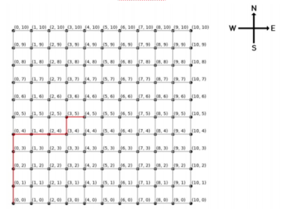

# Assignment-Java-Developer

Assignment Question (Jan 2023) 

---

## Problem 1 - Swapping Min Max

You are given two lists a and b of n positive integers each. You can apply the following swap operations to them any number of times.   

Select an index i (1 <= i <= n) and swap aᵢ with bᵢ (i.e. aᵢ becomes bᵢ and vice versa).  

Write a function minmax(a,b) which takes two lists a and b of size n as inputs and returns an integer, which is the minimum possible value of max(a₁, a₂, …, a ) x max(b₁, b₂, …, b ) you can get after applying the swap operation any number of times (possibly zero).    

**Example** - Consider that the list starts with index 0    
Consider the lists : a = [1, 2, 6, 5, 1, 2] and     
                     b = [3, 4, 3, 2, 2, 5]      
In this case, you can apply the **swap** operation at indices 1 (between 2 and 4) and 5 (between 2 and 5),      
then a = [1, 4, 6, 5, 1, 5] and b = [3, 2, 3, 2, 2, 2] and max(1, 4, 6, 5, 1, 5) x max (3, 2, 3, 2, 2, 2) = 6 x 3 = 18       
 
**Sample Input 1**    
[1, 2, 6, 5, 1, 2]    
[3, 4, 3, 2, 2, 5]    

**Output**    
18   

**Sample Input 2**    
[8,7,9,6,5,6,6,5,6,4,6,7,8,5,4,3,2,1,4,5,6,7,8,7,8]    
[2,4,5,6,7,6,7,8,9,8,7,6,7,6,5,4,3,2,3,4,5,5,5,4,5]    

**Output**    
63     

**Sample Input 3**      
[1,2,3,2,3,4,5,3,5,6,7,8]      
[2,1,5,3,4,6,4,3,2,3,1,2]       

**Output**     
32   

**Solution :**    

```
public class Main  
{  
  static int minmax(int a[], int b[])  
  {  
    int c=0;  
    int d=0;  
    for(int i=0;i<a.length;i++)  
    {  
      if(a[i]>b[i])  
      {  
        c=Math.max(c,a[i]);  
        d=Math.max(d,b[i]);  
      }  
      else  
      {   
        c=Math.max(c,b[i]);  
        d=Math.max(d,a[i]);  
      }  
      return c*d;  
    }  
    public static void main(String[] args){  
      int a[]={8,7,9,6,5,6,6,5,6,4,6,7,8,5,4,3,2,1,4,5,6,7,8,7,8};  
      int b[]={2,4,5,6,7,6,7,8,9,8,7,6,7,6,5,4,3,2,3,4,5,5,5,4,5};  
      System.out.println(minmax(a, b));  
    }  
  }  
}  
```

---
  
## Problem 2 - Employee Listings 

Each line in the file employees.csv contains the full name, role and division of employees separated by a comma. Every line corresponds to one employee. 

The user wants to collect the details of :   
1. Employees who are managers in the R&D division. For managers the string for the role is ‘Manager’ and the division string for employees working in the R&D division is ‘R&D’.   
2. Employees who do not have last names. The name is a combination of first and last name, separated by a space.   

Write a program to collect the required details and write the output into files managers.csv and single_name_employees.csv 
Assume that the employees.csv is present in the present working directory and generate the output in the same directory.    

**Sample Input 1**    
Entries in employees.csv file -   
Name,Role,Division   
Hari Ram,Team-Lead,R&D   
Nirmal Pandey,GET,Production   
Ruban,Manager,R&D   
Aswath,Manager,Production   
Nazar,Team-Lead,Production   
Daniel Jacob,GET,R&D  

**Output**      
Entries in manager.csv file -   
Ruban,Manager,R&D    
Entries in single_name_employees.csv file -   
Ruban,Manager,R&D    
Aswath,Manager,Production   
Nazar,Team-Lead,Production   

**Solution :**    

```
import csv

# Open employees.csv file for reading
with open('employees.csv', 'r') as f:

  # Open managers.csv file for writing
  with open('managers.csv', 'w') as managers_file:

    # Create CSV writer object for managers.csv file
    managers_writer = csv.writer(managers_file)

    # Open single_name_employees.csv file for writing
    with open('single_name_employees.csv', 'w') as single_name_file:

      # Create CSV writer object for single_name_employees.csv file
      single_name_writer = csv.writer(single_name_file)

      # Create CSV reader object for employees.csv file
      reader = csv.reader(f)

      # Loop over each row in employees.csv
      for row in reader:

        # Check if the role is 'Manager' and division is 'R&D'
        if row[1] == 'Manager' and row[2] == 'R&D':

          # Write the row to managers.csv file
          managers_writer.writerow(row)

        # Check if the name has only one part (no last name)
        elif len(row[0].split()) == 1:

          # Write the row to single_name_employees.csv file
          single_name_writer.writerow(row)
```

---

## Problem 3 - Combination Sort 

Write a program that takes a list of unique strings as an argument, where each string is a combination of a letter from `a - z` and a number from `0 - 99` , the initial character in string being the letter. For example a23, d5, z0, q99 are some strings in this format. The program should sort the list and return the lists L1 and L2 in the order mentioned below. 

L1 : First list should contain all strings sorted in ascending order with respect to the first character only. All the strings with the same initial character should be in the same order as in the original list.    

L2 : In the list L1 above, sort the strings starting with the same character, in descending order with respect to the number formed by the remaining characters.    

**Sample Input 1**   
d34, g54, d12, b87, g1, c65, g40, g5, d77     

**Output**   
L1 : b87, c65, d34, d12, d77, g54, g1, g40, g5    
L2 : b87, c65, d77, d34, d12, g54, g40, g5, g1    

**Solution :**  

```
import java.util.*;
public class Main
{
    static ArrayList<ArrayList<String>> combination_sort(ArrayList<String> s)
    {
        ArrayList<String> L1=new ArrayList();
        ArrayList<String> L2=new ArrayList();
        ArrayList<ArrayList<String>> result=new ArrayList();
        HashMap<Character,ArrayList<Integer>> map=new HashMap<Character,ArrayList<Integer>>();
        ArrayList<Integer> ss;
        PriorityQueue<Character> pq = new PriorityQueue<>();
        for(String i:s)
        {
            pq.add(i.charAt(0));
            ss=map.get(i.charAt(0));
            if(ss==null)
            {
                ArrayList<Integer> temp=new ArrayList<Integer>();
                temp.add(Integer.parseInt(i.substring(1)));
                map.put(i.charAt(0),temp);
            }
            else
            {
                ss.add(Integer.parseInt(i.substring(1)));
                map.put(i.charAt(0),ss);
            }
        }
        char c='0';
        while(pq.size()>0)
        {
            if(c!=pq.peek())
            {
                c=pq.peek();
            }
            else
            {
                pq.poll();
                continue;
            }
            ArrayList<Integer> temp1=map.get(c);
            ArrayList<String> temp=new ArrayList<>();
            for(int i:temp1)
            {
                temp.add(c+String.valueOf(i));
            }
            L1.addAll(temp);
            Collections.sort(temp1, Collections.reverseOrder());
            temp.clear();
            for(int i:temp1)
            {
                temp.add(c+String.valueOf(i));
            }
            L2.addAll(temp);
            pq.poll();
        }
        result.add(L1);
        result.add(L2);
        return result;
    }
	public static void main(String[] args) {
	    ArrayList<String> s=new ArrayList<String>(Arrays.asList("d34","g54", "d12", "b87", "g1", "c65", "g40", "g5", "d77"));
	    
		System.out.println(combination_sort(s));
	}
}
```

---

## Problem 4 - Shortest Distance of Manhattan Path 

The below image represents a grid having 11x11 nodes numbered from 0 to 10. 
* Distance between one node to the next connected node is 1 unit. 
* One can go in any direction, each letter counts as 1 unit in each direction. 

* **N** North 
* **S** South 
* **E** East 
* **W** West 

The below graph shows the path of **“NNNNEEENE”** starting from (0,0) 



Write a program to take   

* a start point as an array containing two elements as x and y coordinate, and 
* a string as input 

from the user and print the shortest distance between the start and end point.

**Sample Input 1**  
[0, 0]    
NNNNEEENE     

**Output**    
6.4 [Hint : √((4-0)² + (5-0)²) = 6.4]   

**Sample Input 2**   
[1, 2]    
NEWS    

**Output**   
0   

**Solution :**   

```
import java.util.*;
public class Main
{
  static double shortest_distance(int ar[], String s)
  {
    int a=ar[0], b=ar[1];
    for(int i=0;i<s.length();i++)
    {
      if(s.charAt(i)=='N')
      {
        a++;
      }
      else if(s.charAt(i)=='S')
      {
        a--;
      }
      else if(s.charAt(i)=='E')
      {
        b++;
      }
      else if(s.charAt(i)=='W')
     {
      b--;
     }
    }
    return Math.sqrt(Math.pow(a-ar[0],2)+Math.pow(b-ar[1],2));
  }
  public static void main(String[] args){
    int ar[]={1,2};
    System.out.println(shortest_distance(ar,"NEWS"));
  }
}

```

---

## Problem 5 - Perfect Number     

A perfect number is a positive integer that is equal to the sum of its proper divisors (excluding itself). Write a program that checks whether the input integer is perfect or not. It should return true if the number is perfect. Otherwise it should return false. 

**Sample Input 1**   
8 

**Output**   
false 

**Sample Input 2**   
28 

**Output**   
true 

**Sample Input 3**   
496 

**Output**     
true


**Solution :**  

```
import java.util.*;
public class Main
{
  public static boolean isPerfectNumber(int num) 
  {
    int sum = 0;
    for (int i = 1; i <= num/2; i++) {
        if (num % i == 0)
        sum += i;
        }
    }
    return sum == num;
  }
  public static void main(String[] args){
    int ar=8;
    System.out.println(shortest_distance(ar));
  }
}
```

---
